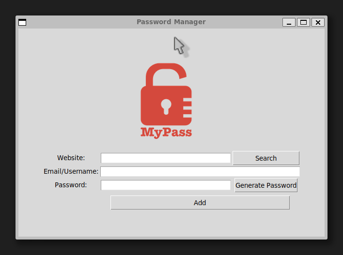

# 🔐 Password Manager

A desktop password manager that generates, saves, and retrieves passwords,
built with Tkinter.

## Demo

## Features

- Generates strong random passwords with letters, numbers and symbols
- Saves credentials (website, email, password) locally in JSON format
- Search for saved credentials by website name

## Requirements

- Python 3.x
- `tkinter` library

On Ubuntu/Debian, install tkinter:

    sudo apt install python3-tk

## Usage

    python main.py

## Project Structure

    Tkinter Password Manager/
    ├── logo.png
    ├── data.json     # auto-generated, stores your credentials locally
    └── main.py

## Built With

- `tkinter` — built-in Python GUI library
- `json` — built-in Python library for data storage

## License

MIT