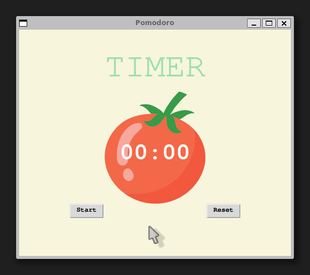

# 🍅 Pomodoro Timer

A desktop Pomodoro timer built with Tkinter, designed to boost productivity
using the Pomodoro Technique.

## Demo

## How it works

1. Click **Start** to begin a 25-minute work session
2. After each session, a short 5-minute break starts automatically
3. After every 4 sessions, a long 20-minute break is triggered
4. Completed sessions are tracked with ✓ checkmarks
5. Click **Reset** to restart the timer at any time

## Pomodoro Cycle

| Session | Duration |
|---------|----------|
| Work | 25 minutes |
| Short Break | 5 minutes |
| Long Break | 20 minutes |

## Requirements

- Python 3.x
- `tkinter` library

On Ubuntu/Debian, install tkinter:

    sudo apt install python3-tk

## Usage

    python main.py

## Built With

- `tkinter` — built-in Python GUI library
- `math` — built-in Python library

## License

MIT