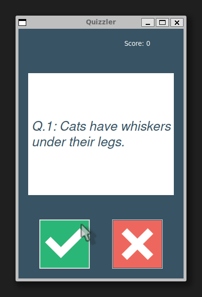

# 🧠 Quizzler — True or False Quiz Game

A desktop quiz game that fetches real trivia questions from an API
and challenges you with True or False answers, built with Tkinter.

## Demo

## How it works

1. Fetches 10 random True/False questions from the Open Trivia Database API
2. Displays each question on a card
3. Click ✅ for True or ❌ for False
4. The card flashes green for correct and red for incorrect answers
5. Your score is tracked and displayed at the end

## Requirements

- Python 3.x
- `requests` library
- `tkinter` library

Install dependencies:

    pip install requests

On Ubuntu/Debian, install tkinter:

    sudo apt install python3-tk

## Usage

    python main.py

## Project Structure

    Tkinter Quiz Game/
    ├── data.py             # fetches questions from API
    ├── question_model.py   # Question class
    ├── quiz_brain.py       # quiz logic
    ├── ui.py               # Tkinter interface
    ├── main.py             # entry point
    ├── true.png
    └── false.png

## Built With

- [Open Trivia Database API](https://opentdb.com/) — trivia questions
- `tkinter` — built-in Python GUI library
- `requests` — HTTP requests
- `html` — built-in Python library for decoding HTML entities

## License

MIT