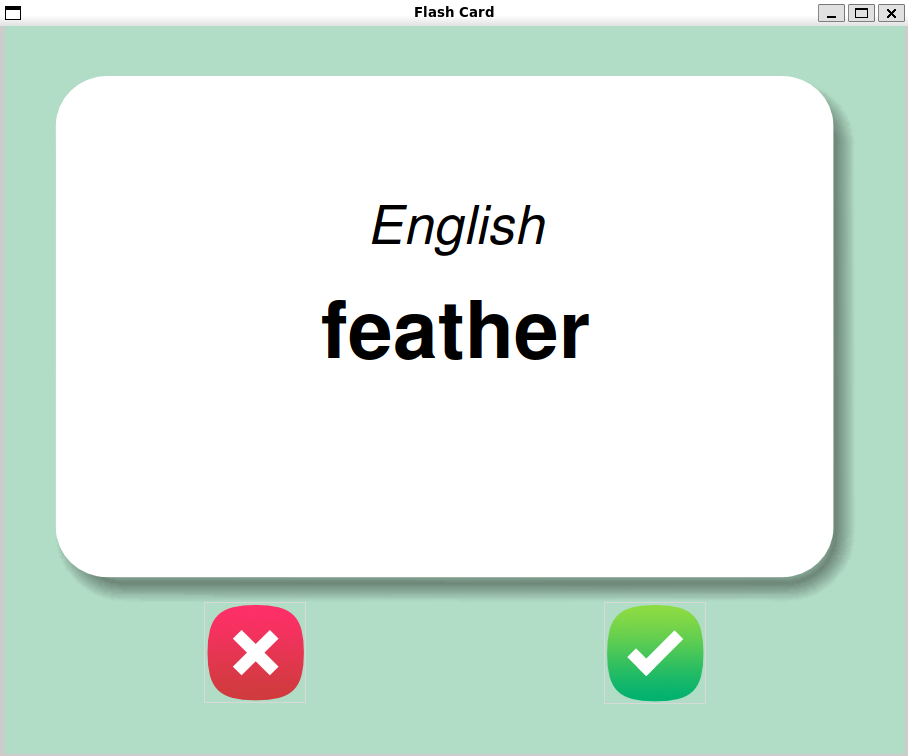
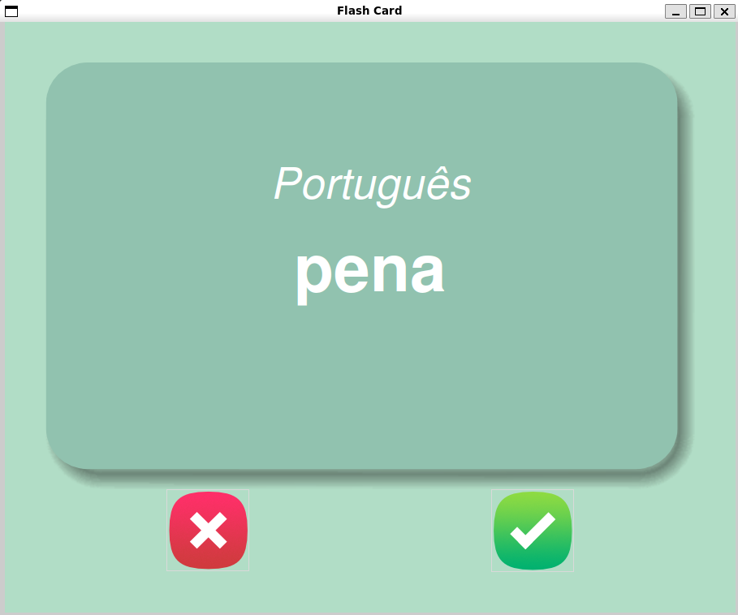

# 🃏 English-Portuguese Flash Cards

A desktop flashcard app to practice English vocabulary with Portuguese translations,
built with Tkinter.

## Screenshots

| English | Portuguese |
|---------|------------|
|  |  |

## How it works

1. A random English word is displayed on the card
2. After 3 seconds the card flips and shows the Portuguese translation
3. Click ✅ if you knew the word — it gets removed from the deck
4. Click ❌ if you didn't know — it stays in the deck for later
5. Your progress is saved automatically in `data/words_to_learn.csv`
6. When all cards are completed, you can restart from the beginning

## Requirements

- Python 3.x
- `pandas` library
- `tkinter` library

Install dependencies:

    pip install pandas

On Ubuntu/Debian, install tkinter:

    sudo apt install python3-tk

## Usage

    python main.py

## Project Structure

    Tkinter en-pt Flash Cards/
    ├── data/
    │   ├── english_words.csv     # full word list
    │   └── words_to_learn.csv    # remaining words (auto-generated)
    ├── images/
    │   ├── card_front.png
    │   ├── card_back.png
    │   ├── right.png
    │   └── wrong.png
    └── main.py

## Built With

- `tkinter` — built-in Python GUI library
- `pandas` — CSV data management

## License

MIT